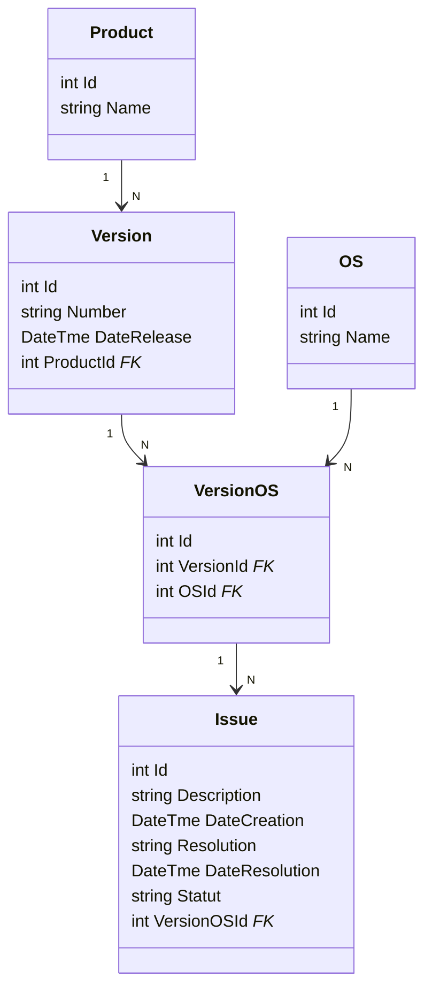

# P6_NexaWorks

NexaWorks développe différents produits logiciels. 

Chaque produit dispose de plusieurs versions, et chacune d’elles est compatible avec un ou plusieurs systèmes d’exploitation.

Notamment : Windows, MacOS, Linux, Android, et iOS. 

L’entreprise doit assurer le suivi des problèmes qui surviennent pour chaque version et chaque système d’exploitation. 
 
Elle ne dispose actuellement d’aucune application pour ce faire. 

L'objectif de ce projet est de concevoir et de créer une base de données relationnelle capable de stocker 

et de suivre tous les problèmes qui surviennent avec les produits au cours du cycle de vie de chaque version,

ainsi que la résolution de chacun de ces problèmes.

Le Modèle Conceptuel de Données est le suivant

